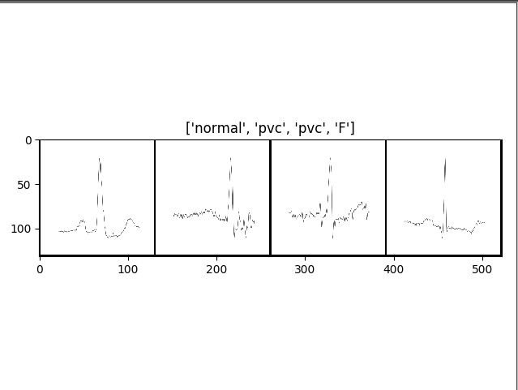

# ECG Classification
## check the train image

    python train_img_check.py

## How to train?
    python train.py --option

### options
|typing|means|defualt|
|---|:---:|---:|
|'--root_dir|root dir|./data/2_class_img_data|
|'--model|model name|efficientnet|
|'--image_size|image size|128|
|'--epochs|epochs|30|
|'--learning_rate|learning rate|0.1|
|'--batch_size|batch size|32|
|'--weights_dir|weights directory|./checkpoint/|
|'--runs_dir|runs directory|./runs/|
---
### EfficientNet B4
    python train.py
#### result
- best val acc: 62.1875
- best val lr: 0.009227 (start 0.1)
- batch size: 64
- image size:128*128
- epoch: 30
- weight: https://drive.google.com/file/d/1mch4ID1OznuXT_8DpW93Ty1Cs2bzNXec/view?usp=sharing
---
### ResNet101
    python train.py --model resnet --learning_rate 0.01
#### result
- best val acc: 62.125
- best val lr: 0.008775 (start 0.01)
- batch size: 64
- image size:128*128
- epoch: 30
- weight: https://drive.google.com/file/d/1r9iSJiHh6WjmnksSlADZHFnD3o-qk741/view?usp=sharing
---
### VGG16bn
    python train.py --batch_size 32 --model vgg --learning_rate 0.01 
#### result
- best val acc: 30.843750
- best val lr: 0.008345 (start 0.01)
- batch size: 32
- image size:128*128
- epoch: 30
- weight: https://drive.google.com/file/d/1ykNZKVWV6WrVCVR13LxH-3GkIbRipA5I/view?usp=sharing
---
### View the tensorboard
    tensorboard --logdir=runs
